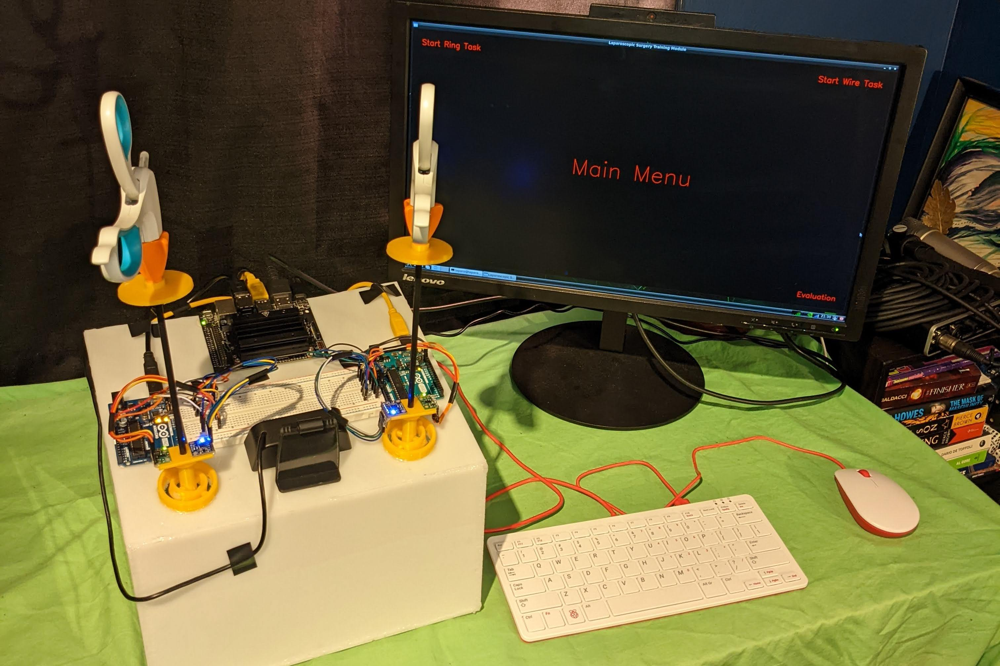

# Augmented Reality Laparoscopic Surgery Trainer
## Project Abstract
The field of laparoscopy is relatively new in the surgery world and it has distinct benefits over traditional “open” surgery techniques. However, these benefits come at the cost of a more complex procedure and a need for advanced training with the required equipment. In order to fulfill this need, various training aparati have been developed and tested, the most beneficial of which is Augmented Reality training modules as they combine the benefits of both physical simulators. Over the course of this project, we have developed a low-cost, stand-alone, training module instrumented with motion tracking sensors, Augmented Reality guidance and feedback, and a simple analysis system. This project can be easily carried into future years as the module built can easily continue to be improved through various methods and the research complete can be used to further branch this project into further territories. For the most part, this project has run smoothly over the two semesters, though this required some modifications and adjustments to the communication and team protocols as the project continued. We hope that the complete motion tracking and Augmented Reality training module will continue to be used in future projects for years to come and eventually be able to actively contribute to this vital field of advanced laparoscopic surgery training.

## Overview
This project involves the creation of an Augmented Reality Laparoscopic Surgery Training Apparatus. For a simple summary the final video for the Project is available on youtube:
https://www.youtube.com/watch?v=6su7bXyjUVA&t=7s&ab_channel=MichaelMarsland  
   
This project is broken up into a few parts: The collection of motion data from the sensors, the training program and real-time feedback, and the post-task analysis and evaluation.

The majority of the software for this project is written in python with some Arduino Code (C++) to interface with the sensors.

The hardware for the project is summarized in the final report but here is an image of the final set-up:

## Content
This github repo contains the main files for the project. Each item is described below:

### [augmented-reality](augmented-reality/)
The code for the python program that runs on the Jetson Nano. This includes the code for the
augmentedReality program that is displayed on the monitor as well as the code that collects data from the arduinos,
the analyzer code and the program code that ties it all together.

### [images](images/)
Some example images of the project and the projects various components

### [sensor-code](sensor-code/)
The code for the arduinos that collect data from the sensors and pass it along to the python program.

### [virtual-simulator](virtual-simulator/)
The code for the experimental tool-tip tracking virtual simulator built in blender. This is independent from the rest
of the project but may be useful for projects in future years.

### [Final Report]("Final Report - Group 33 - Augmented Reality Laparoscopic Surgery Trainer.pdf")
The final report for the project. This includes a more detailed overview of the project. I also includes the project
proposal and other important information about the project.

### [Nasr Paper]("Nasr et al - J Pediatric Surgery 2014.pdf")
A paper by Dr. Nasr et al that inspired the main work for this project.

### 3D Models
The 3D models for this project were created in OnShape. The files can be viewed here as well as copied to your own account if you wish to continue development.
https://cad.onshape.com/documents/7f866657db48ee6f939736f3/w/f6c8ad786f0bbfbba4a34716/e/9dcc6291ce942c2611d11cf7?renderMode=0&uiState=626053507ac13c055e536b5c

## How-to

## Tips

## Contact

